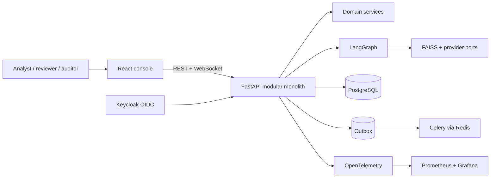
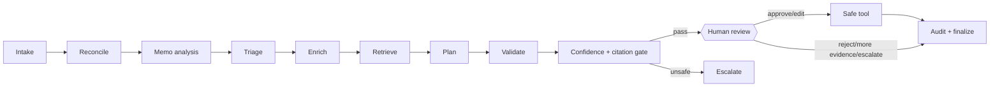

# TradeOps Copilot

[](https://github.com/la3679/tradeops-insight/actions/workflows/ci.yml) [](https://github.com/la3679/tradeops-insight/actions/workflows/security.yml) [](LICENSE) [](backend/pyproject.toml) [](tsconfig.json)

TradeOps Copilot is a review-first investigation console for synthetic fixed-income trade exceptions. It combines deterministic reconciliation, grounded retrieval, an interruptible LangGraph workflow, role-aware APIs, and an accessible React workspace.

> **Independent project:** This educational portfolio project uses only deterministic synthetic trades and small attributed public reference fixtures. It is not affiliated with a financial institution, does not connect to a broker or venue, cannot execute real trades, and is not financial advice.


## What it demonstrates

- 2,400 replayable synthetic trades and 300 exceptions spanning twelve categories
- deterministic rules, typed facts, idempotent imports, optimistic versions, audit history, and outbox delivery
- FAISS retrieval with provenance, citations, filters, injection detection, and weak-evidence escalation
- a thirteen-node LangGraph flow that pauses for human approval before allowlisted demo mutation
- mock-first provider abstraction with OpenAI, Bedrock, and local-provider boundaries
- FastAPI v1 contracts, production OIDC/JWKS validation, local demo roles, RBAC, polling, and WebSockets
- responsive queue, investigation, approval, knowledge, evaluation, audit, and observability screens
- OpenTelemetry, Prometheus alerts, Grafana provisioning, 50-case evaluation, E2E, accessibility, and security gates

## Architecture





The backend remains a modular monolith until scaling evidence justifies distribution. PostgreSQL adapters, migrations, checkpoints, and outbox persistence are integration-tested. The current web-facing demo mutation service intentionally uses process memory and resets on API restart. See the [architecture overview](docs/architecture/overview.md).

## Quick start

Prerequisites: Docker Desktop with Linux containers, Git, and at least 8 GB available memory.

```powershell
git clone https://github.com/la3679/tradeops-insight.git
cd tradeops-insight
Copy-Item .env.example .env
docker compose up --build -d
docker compose ps
```

Open the web console at `http://127.0.0.1:3000`, API docs at `http://127.0.0.1:8000/docs`, Keycloak at `http://127.0.0.1:8080`, Grafana at `http://127.0.0.1:3001`, and Prometheus at `http://127.0.0.1:9090`. Grafana uses `admin` / `tradeops-grafana-local-only`.

No API key or paid model is required. The UI has a labelled local role selector. Seeded Keycloak accounts are `analyst`, `supervisor`, `auditor`, and `administrator`; each password is `<username>-local-only`. Stop with `docker compose down`.

For host development, install Node 24, Bun 1.4, Python 3.14, and uv 0.12, then run:

```powershell
bun install --frozen-lockfile
uv sync --directory backend --all-groups --locked
uv run --directory backend alembic upgrade head
npm run dev
```

## Providers and data

`mock` is the replayable default. Optional provider credentials belong only in an untracked `.env` or deployment secret store; never expose them to the browser. Public fixtures are one-record, hash-verified samples from GLEIF, SEC EDGAR, and U.S. Treasury Fiscal Data. See [DATA_LICENSES.md](DATA_LICENSES.md), [provenance](docs/data/provenance.md), and the [system card](docs/evaluation/system-card.md).

## Primary journey

1. Filter the deterministic exception queue.
2. Inspect facts, rule explanation, evidence, citations, and trace.
3. Start an idempotent investigation as analyst.
4. Review as reviewer: approve, edit, reject, request evidence, or escalate.
5. Verify version checks, outcome, and append-only audit evidence.
6. Confirm auditor read-only access.

## Verification

```powershell
npm run verify
npm run test:e2e
uv run --directory backend --locked python ../scripts/validate_openapi.py
uv run --directory backend --locked python ../scripts/run_eval.py
docker compose config --quiet
```

Current local evidence: 74 backend tests at 96%+ coverage; 20 frontend tests at 100% statements/functions/lines and 94%+ branches over selected meaningful surfaces; six desktop/tablet E2E journeys; and 50/50 deterministic evaluation cases. These are reproducible baselines, not production or model-accuracy claims. See [testing](docs/development/testing.md), [evaluation](docs/evaluation/baseline.md), and [performance](docs/performance/baseline-2026-08-24.md).

Production mode requires signed RS256 OIDC tokens with issuer, audience, timestamp, subject, and role checks. Strict CORS, body limits, rate limiting, security headers, idempotency, and server-owned authorization are enforced. Model output remains advisory and tools remain approval-gated. See [security](docs/security/architecture.md) and [operations](docs/operations/runbook.md).

## Repository and limits

`backend/` contains service code and tests; `src/` the web client; `tests/e2e/` Playwright; `data/` fixtures and provenance; `infra/` identity, observability, and cloud reference; `performance/` k6; and `docs/` the indexed handbook.

Compose is the verified local deployment. Terraform is a reference, not a deployed production claim. Non-goals include live trade feeds, brokerage integration, autonomous remediation, universal calendars, institutional policies, and production SLOs. See [deployment](docs/development/deployment.md), [ROADMAP.md](ROADMAP.md), and [SUPPORT.md](SUPPORT.md).

[Documentation](docs/README.md) · [Demo](DEMO.md) · [Contributing](CONTRIBUTING.md) · [Security](SECURITY.md) · [Changelog](CHANGELOG.md) · [Apache-2.0](LICENSE)

Built by [Love Jayesh Ahir](https://github.com/la3679) · [loveahir.com](https://loveahir.com)
