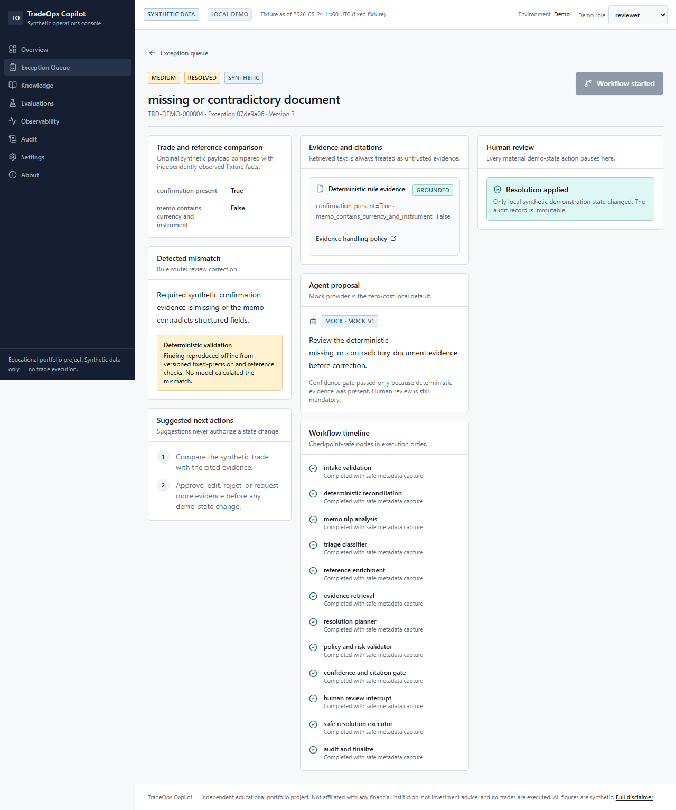
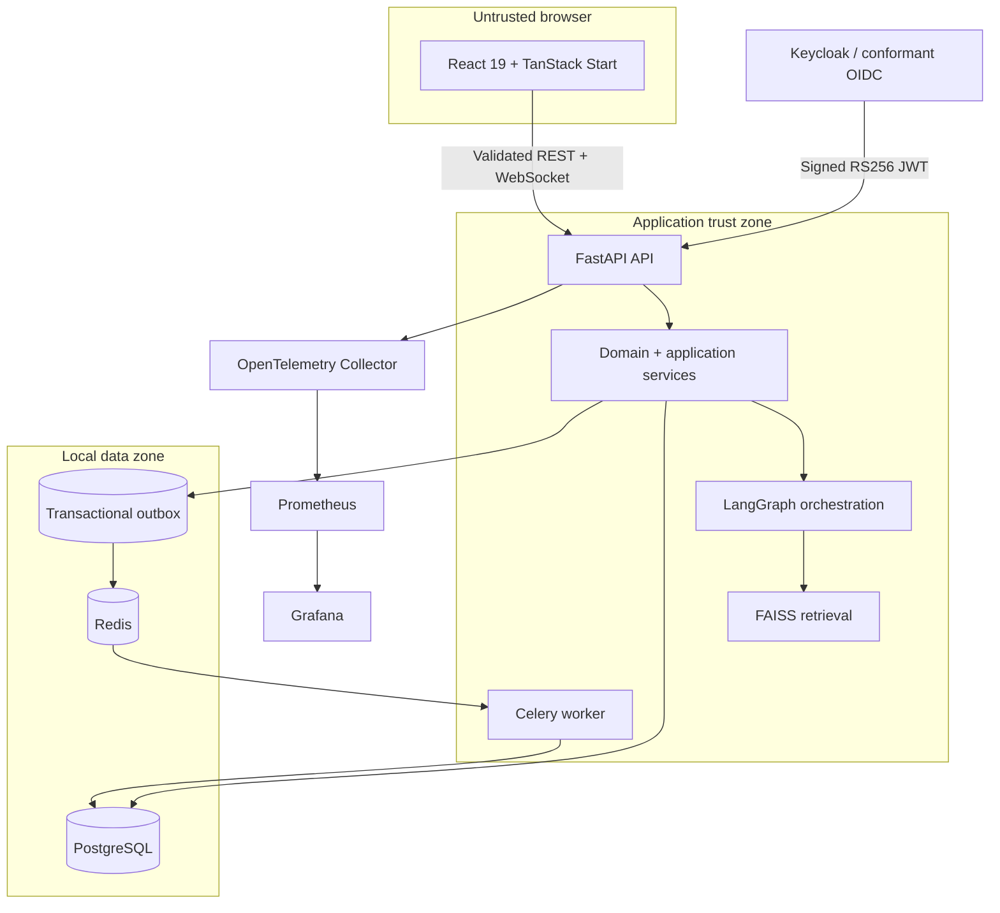
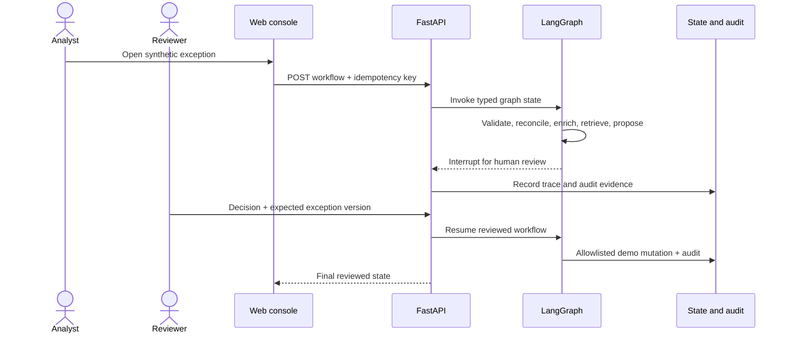
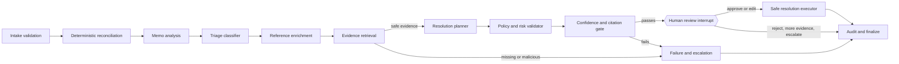
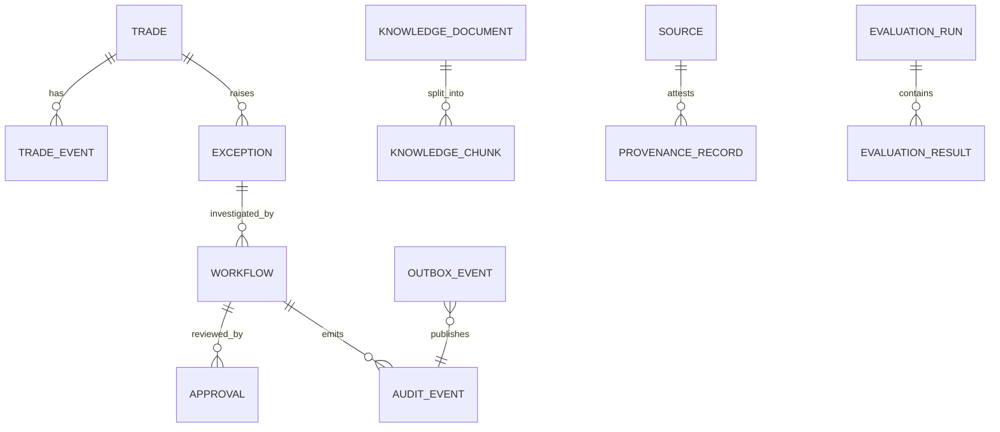

# TradeOps Copilot

<div align="center">

**A review-first investigation console for deterministic, synthetic fixed-income trade exceptions.**

[](https://github.com/la3679/tradeops-insight/releases/tag/v0.1.0)
[](https://github.com/la3679/tradeops-insight/actions/workflows/ci.yml)
[](https://github.com/la3679/tradeops-insight/actions/workflows/security.yml)
[](LICENSE)
[](backend/pyproject.toml)
[](tsconfig.json)
[](compose.yaml)

[Quick start](#quick-start) · [Architecture](#architecture) · [Demo](#ten-minute-demo) · [Verification](#verification-and-quality) · [Release](https://github.com/la3679/tradeops-insight/releases/tag/v0.1.0)

</div>

TradeOps Copilot combines deterministic reconciliation, evidence-grounded retrieval, an interruptible thirteen-node LangGraph workflow, server-enforced role boundaries, and an accessible React investigation workspace. It demonstrates how an AI-assisted operations product can remain explainable, replayable, observable, and under human control.

> [!IMPORTANT]
> TradeOps Copilot is an independent educational portfolio project. It is not affiliated with any financial institution, does not connect to a broker, venue, exchange, or order-management system, cannot execute trades, and is not financial advice. Operational records are deterministic synthetic data; the three minimized public fixtures are reference-shape examples only.



## Table of contents

- [Why this project exists](#why-this-project-exists)
- [Release status](#release-status)
- [Product experience](#product-experience)
- [Architecture](#architecture)
- [Domain model and exception catalogue](#domain-model-and-exception-catalogue)
- [Synthetic and public data](#synthetic-and-public-data)
- [AI, RAG, and agent workflow](#ai-rag-and-agent-workflow)
- [API and real-time contracts](#api-and-real-time-contracts)
- [Security, privacy, and threat model](#security-privacy-and-threat-model)
- [Quick start](#quick-start)
- [Developer workflow](#developer-workflow)
- [Ten-minute demo](#ten-minute-demo)
- [Verification and quality](#verification-and-quality)
- [Performance baseline](#performance-baseline)
- [Deployment and operations](#deployment-and-operations)
- [Frontend, design system, and accessibility](#frontend-design-system-and-accessibility)
- [Repository structure](#repository-structure)
- [Known limitations and roadmap](#known-limitations-and-roadmap)
- [Contributing, support, and conduct](#contributing-support-and-conduct)
- [Documentation coverage](#documentation-coverage)
- [License and author](#license-and-author)

## Why this project exists

Trade operations investigations are a useful setting for disciplined software and AI engineering: inputs can be inconsistent, evidence can be incomplete or adversarial, actions require authorization, and every decision needs an audit trail. This project models those concerns without proprietary systems or real trade data.

### What the release demonstrates

| Capability             | Implemented behavior                                                                                                                                                                  |
| ---------------------- | ------------------------------------------------------------------------------------------------------------------------------------------------------------------------------------- |
| Deterministic domain   | 2,400 replayable synthetic trades, 300 deliberate exceptions, twelve rule families, typed facts, stable identifiers, decimal amounts, UTC timestamps, and versioned policies          |
| Investigation workflow | Queue → investigation → workflow → review interrupt → allowlisted demo mutation → append-only audit                                                                                   |
| Human control          | Analysts investigate; reviewers approve, edit, reject, request evidence, or escalate; auditors remain read-only; administrators operate labelled demo controls                        |
| RAG safety             | Deterministic embeddings, FAISS retrieval, metadata filters, content hashes, citations, minimum scores, provenance, instruction-injection detection, and weak-evidence escalation     |
| Agent orchestration    | Typed thirteen-node LangGraph with deterministic gates, explicit routing, PostgreSQL checkpoint support, review interrupts, provider/version metadata, and resumability               |
| Platform contracts     | FastAPI v1 REST/OpenAPI, OIDC/JWKS validation, RBAC, idempotency, optimistic versions, problem JSON, polling, WebSockets, outbox delivery, and audit                                  |
| Product UI             | Responsive overview, exception queue, investigation, approval, knowledge, evaluation, observability, audit, settings, role selector, degraded states, and tablet layout               |
| Operability            | PostgreSQL, Redis, Celery, Keycloak, OpenTelemetry Collector, Prometheus, Grafana, structured logs, correlation IDs, health probes, and runbooks                                      |
| Delivery discipline    | Strict TypeScript/Python checks, unit/integration/API tests, Playwright and axe, deterministic evaluation, k6 baselines, CodeQL, Gitleaks, Trivy, dependency audits, and an SPDX SBOM |

### Users and intended outcomes

| Role                  | Intended outcome                                                                                                       | Mutation posture                                                    |
| --------------------- | ---------------------------------------------------------------------------------------------------------------------- | ------------------------------------------------------------------- |
| Analyst               | Inspect the exception queue, immutable facts, deterministic explanations, evidence, citations, and proposed next steps | May start an idempotent investigation; cannot approve final action  |
| Reviewer / supervisor | Compare proposals with evidence and current version, then approve, edit, reject, request more evidence, or escalate    | May resume a review interrupt through server-enforced authorization |
| Auditor               | Inspect evidence, workflow state, tool activity, human decisions, and append-only history                              | Read-only                                                           |
| Demo administrator    | Configure non-sensitive local settings, run fixture imports/evaluations, and inspect platform state                    | Limited to explicit, labelled administrative demo operations        |

### Non-goals

- real orders, trades, positions, accounts, settlement, brokerage, exchange, or venue connectivity
- employer code, client data, internal prompts, schemas, branding, policies, or operating procedures
- autonomous remediation or model-authorized state changes
- frontend ownership of authorization, pricing, risk, or settlement rules
- universal market calendars or production-certified reference-data behavior
- production adoption, compliance, savings, accuracy, capacity, latency, or effectiveness claims
- a mandatory paid model, API key, cloud account, or hosted dependency for the default demo

## Release status

The reviewed `v0.1.0` release is complete on the public, Lovable-connected `main` branch.

| Item                | Status                                                                                                                     |
| ------------------- | -------------------------------------------------------------------------------------------------------------------------- |
| Public repository   | [github.com/la3679/tradeops-insight](https://github.com/la3679/tradeops-insight)                                           |
| Reviewed release PR | [#12 — Complete and harden TradeOps Copilot v0.1.0](https://github.com/la3679/tradeops-insight/pull/12)                    |
| Release             | [TradeOps Copilot v0.1.0](https://github.com/la3679/tradeops-insight/releases/tag/v0.1.0)                                  |
| Release evidence    | SPDX JSON SBOM attached to the release; CI and Security workflows green                                                    |
| Dataset             | 2,400 deterministic synthetic trades; 300 exceptions; 30 synthetic policy documents                                        |
| Public fixtures     | Three transformed one-record fixtures with URLs, terms, timestamps, row counts, transformations, paths, and SHA-256 hashes |
| AI default          | `mock/deterministic-v1`; temperature `0`; no credential or estimated provider cost                                         |
| Evaluation          | `golden-v1`: 50 total, 50 passed, 0 failed                                                                                 |

The implementation and release evidence are summarized in [PROJECT_STATE.md](PROJECT_STATE.md); notable changes are recorded in [CHANGELOG.md](CHANGELOG.md).

## Product experience

### Primary journey

1. Generate or import the versioned deterministic synthetic dataset.
2. Validate its schema and detect deterministic exception categories.
3. Filter the queue and open an exception.
4. Inspect immutable trade facts, rule explanations, evidence, citations, assumptions, versions, and trace steps.
5. Start an idempotent investigation as an analyst.
6. Enrich and retrieve evidence only through typed, allowlisted adapters.
7. Produce an advisory proposal and validate it against deterministic policy and citation gates.
8. Pause for a human review decision.
9. Apply only the reviewed, allowlisted synthetic-state correction with the expected exception version.
10. Verify separate approval, tool, outcome, and audit evidence; confirm auditor read-only behavior.

### Application surfaces

| Surface       | Purpose                                                                                                               |
| ------------- | --------------------------------------------------------------------------------------------------------------------- |
| Overview      | Summarizes dataset state, exception categories, queue lanes, recent cases, and freshness                              |
| Exceptions    | Searchable/filterable queue with severity, status, ownership, category, and review-route cues                         |
| Investigation | Shows trade facts, deterministic explanation, evidence, suggested actions, graph trace, versions, and review controls |
| Knowledge     | Exposes synthetic/public labels, source provenance, content hashes, versions, and retrieval context                   |
| Evaluations   | Displays the deterministic 50-case baseline and prompt/provider/model metadata                                        |
| Observability | Links health, metrics, traces, service status, and operational guidance                                               |
| Audit         | Provides role-restricted, append-only decision and activity history                                                   |
| Settings      | Shows masked, non-sensitive runtime/provider configuration and labelled demo operations                               |

Every mutation uses an idempotency key. Version conflicts require a refresh; the client must never fabricate a version. Missing, weak, stale, contradictory, or malicious evidence is expected to escalate rather than bypass a gate.

## Architecture

### Runtime topology



The system deliberately begins as a modular monolith plus independently runnable worker. Network separation is not a substitute for clear module boundaries; a service is extracted only when measured ownership, deployment cadence, data ownership, fault isolation, or scaling needs justify it.

### Investigation and approval sequence



### Typed graph



No model node performs authoritative monetary/date calculations, authorizes a user, writes directly to persistence, or bypasses review.

### Data relationships



### Ownership and dependency direction

| Module          | Owns                                                                                         | Must not own                                                 |
| --------------- | -------------------------------------------------------------------------------------------- | ------------------------------------------------------------ |
| `web`           | Routes, accessible components, API client, state presentation, polling/WS fallback           | Authorization, financial rules, workflow policy, secrets     |
| `domain`        | Trade/event validation, exception facts, proposals, approvals, audit types, invariant checks | FastAPI, SQLAlchemy, LangGraph, provider SDKs, vector stores |
| `application`   | Ingestion, investigation, review, resolution use cases, and typed ports                      | Framework-specific infrastructure details                    |
| `orchestration` | Typed graph state, nodes, routing, checkpoints, interrupts, provider/version metadata        | Direct database writes or arbitrary tools                    |
| `adapters`      | Persistence, queue, retrieval, model providers, public data, object/file storage             | Domain-policy decisions                                      |
| `worker`        | Idempotent asynchronous command handlers                                                     | HTTP-request ownership or invented business logic            |
| `observability` | Structured logging, metrics, traces, correlation context                                     | Secrets, tokens, full prompts, raw bodies                    |

Dependencies point inward: frameworks and adapters → application ports → domain. Lovable-owned changes remain limited to frontend structure, presentation, accessibility, and design-system work; backend, security, authorization, model behavior, and financial/domain rules require separate review.

### Failure behavior

- invalid input is rejected with a stable problem response and request ID
- duplicate commands replay safely through idempotency
- stale expected versions return a conflict
- missing, malicious, contradictory, or weak evidence escalates
- provider failure uses an explicitly labelled fallback or escalation
- outbox gaps defer until missing aggregate sequences arrive
- WebSocket clients can fall back to polling
- observability failure does not change domain results
- Redis is transient; PostgreSQL and the outbox remain authoritative

### Architecture decisions

| ADR                                                                 | Decision                                                                                                                         |
| ------------------------------------------------------------------- | -------------------------------------------------------------------------------------------------------------------------------- |
| [0001](docs/adr/0001-modular-monolith-and-worker.md)                | Use a modular FastAPI backend plus worker until measured evidence justifies services                                             |
| [0002](docs/adr/0002-python-runtime-and-task-queue.md)              | Use Python 3.14, uv, FastAPI, Celery, Redis, JSON-only tasks, UTC, late acknowledgements, and rejection on worker loss           |
| [0003](docs/adr/0003-relational-persistence-and-idempotency.md)     | Make PostgreSQL authoritative with SQLAlchemy, Alembic, UUIDs, fixed precision, optimistic versions, and unique idempotency keys |
| [0004](docs/adr/0004-offline-retrieval-and-explicit-agent-graph.md) | Use deterministic offline FAISS retrieval and a typed thirteen-node LangGraph rather than a generic agent loop                   |
| [0005](docs/adr/0005-oidc-provider-strategy.md)                     | Validate standards-based OIDC/JWKS at the API; use Keycloak for a reproducible local realm                                       |
| [0006](docs/adr/0006-transactional-outbox.md)                       | Commit domain state and outbox records together; deliver at least once with event IDs and aggregate sequences                    |
| [0007](docs/adr/0007-human-control-policy.md)                       | Interrupt every resolution proposal; allow only reviewer/admin resume paths with version and idempotency checks                  |
| [0008](docs/adr/0008-model-provider-abstraction.md)                 | Depend on a typed provider port with deterministic mock authority and explicit optional adapters/fallback                        |
| [0009](docs/adr/0009-observability-stack.md)                        | Instrument boundaries with OpenTelemetry, bounded Prometheus labels, provisioned Grafana, and correlation IDs                    |
| [0010](docs/adr/0010-public-synthetic-data.md)                      | Keep operations synthetic; minimize and fully attest any public reference fixture                                                |

### Scaling path

Before increasing load, externalize demo mutations to PostgreSQL, scale stateless API replicas behind a load balancer, partition worker queues by task class, move FAISS artifacts to versioned object storage, and add a shared event transport with bounded per-client buffers for WebSocket fan-out. Preserve correlation IDs, idempotency, event schemas, and audit continuity across every future boundary.

## Domain model and exception catalogue

### Core terms

| Term                     | Definition                                                                                                                                                              |
| ------------------------ | ----------------------------------------------------------------------------------------------------------------------------------------------------------------------- |
| Synthetic trade          | Immutable, versioned invented trade facts. IDs use `TRD-DEMO-000000` and `INST-DEMO-000000`; amounts use decimal arithmetic and timestamps use UTC.                     |
| Exception finding        | Deterministic rule output containing trade, rule version, severity, review route, explanation, evidence, and suggested actions. It is evidence—not mutation permission. |
| Settlement-date mismatch | Difference between observed settlement date and an explicit versioned business-day policy that skips weekends and only supplied demo holidays.                          |
| Review correction        | A route that lets a reviewer compare a nearby proposed correction with synthetic evidence. The rule itself never applies the correction.                                |
| Escalation               | A safe outcome for anomalous, uncertain, unsupported, stale, contradictory, malicious, or materially different cases.                                                   |

### Twelve exception families

| Type                           | Deterministic trigger                           | Review posture                                        |
| ------------------------------ | ----------------------------------------------- | ----------------------------------------------------- |
| Invalid counterparty LEI       | Missing or not `LEI-DEMO-000000`                | Correct malformed value; escalate missing identity    |
| Counterparty name mismatch     | Normalized trade/reference names differ         | Review typo; escalate blank legal name                |
| Unknown or inactive entity     | LEI absent from snapshot or inactive            | Review inactive state; escalate unknown identity      |
| Instrument ID mismatch         | Trade/reference synthetic IDs differ            | Review known-format mismatch; escalate unknown format |
| Notional mismatch              | Fixed-precision delta exceeds tolerance         | Escalate material deltas                              |
| Price outside tolerance        | Absolute price delta exceeds policy             | Escalate values over five times tolerance             |
| Currency mismatch              | Trade/instrument currencies differ              | Escalate unsupported currencies                       |
| Settlement-date mismatch       | Date differs from versioned business-day policy | Escalate pre-trade or material date deltas            |
| Duplicate trade/event          | Duplicate trade or event key observed           | Escalate when both collide                            |
| Missing/contradictory document | Confirmation absent or memo contradicts fields  | Escalate missing required evidence                    |
| Stale reference data           | Snapshot exceeds freshness bound                | Escalate at more than three times the bound           |
| Unsupported/malformed trade    | Unsupported product or malformed payload        | Escalate malformed payloads                           |

Every finding is explainable, replay-stable, non-mutating, and routes through human review before a synthetic demo correction.

### Canonical data dictionary

| Entity                   | Key fields                                                                     | Invariants                                             |
| ------------------------ | ------------------------------------------------------------------------------ | ------------------------------------------------------ |
| Trade                    | Synthetic trade ID, product, currency, notional, price, trade/settlement dates | Immutable facts; UTC/event versioning                  |
| Trade event              | Event ID, aggregate ID, sequence, occurred-at                                  | Append-only and ordered per aggregate                  |
| Exception                | ID, type, severity, status, review route, evidence, version                    | Exactly one synthetic trade; optimistic mutation       |
| Workflow                 | ID, exception ID, graph/prompt/provider/model versions, status, steps          | Replayable; approval interrupt before tool             |
| Approval                 | Workflow, decision, reviewer, expected version                                 | Reviewer/admin only; idempotent                        |
| Audit event              | Actor, subject, type, time, summary                                            | Append-only; no secret contents                        |
| Knowledge document/chunk | Provenance, version, jurisdiction, hash, content                               | Public/synthetic label; untrusted instructions flagged |
| Outbox event             | ID, aggregate sequence, payload, publication state                             | Written with state; at-least-once delivery             |
| Evaluation case/run      | Dataset, prompt, provider/model versions, expected/actual                      | Deterministic mock replay                              |

## Synthetic and public data

### Synthetic methodology

The generator uses stable seeds and namespaces to create 2,400 fictional fixed-income trades. Exactly 300 records deliberately express all twelve exception families; remaining records are internally consistent controls. Counterparties, identifiers, amounts, dates, memos, statuses, users, and audit actors are generated—not perturbed real records.

Rule or dataset changes require a new version, reproducibility test, category-count assertion, changelog entry, and updated evidence. Distribution and anomalies are chosen for behavioral coverage, not claimed realism. Settlement policy `v1` handles weekends and explicitly provided demo holidays only.

### Public reference fixtures

Application trades, exceptions, policies, users, and audit events are Apache-2.0 synthetic data. The repository includes one transformed public record from each source:

| Source                    | Purpose                      | Terms                                                                    |
| ------------------------- | ---------------------------- | ------------------------------------------------------------------------ |
| GLEIF Global LEI Index    | Entity-reference shape       | [GLEIF terms](https://www.gleif.org/en/meta/lei-data-terms-of-use)       |
| SEC EDGAR Submissions API | Public filer-reference shape | [SEC developer resources](https://www.sec.gov/about/developer-resources) |
| U.S. Treasury Fiscal Data | Security-schedule shape      | [Fiscal Data API](https://fiscaldata.treasury.gov/api-documentation/)    |

`data/provenance/manifest.json` is authoritative for source URL, terms URL, UTC retrieval time, transformation, row count, repository path, and SHA-256. Public sources provide reference context only; they do not provide synthetic trades.

To refresh a fixture: review current terms and rate/robots guidance, fetch only from the allowlist with a descriptive user agent and timeout, minimize fields, inspect for personal/confidential content, recompute the hash, update the manifest and [DATA_LICENSES.md](DATA_LICENSES.md), run provenance/full tests, and obtain review. Builds and tests remain fixture-only and offline by default.

### Deterministic triage

1. Confirm the record is labelled synthetic and note its rule version.
2. Compare finding evidence with the immutable trade/event snapshot.
3. Request more evidence when freshness, confirmation, or memo provenance is insufficient.
4. Approve/edit only an allowlisted demo-field correction and only against the current exception version.
5. Reject unsupported changes; escalate unknown identities, malformed payloads, material numeric differences, contradictory evidence, and stale-version conflicts.
6. Verify that approval and resulting action are separate immutable audit events.

### Settlement-date mismatch runbook

Rule `settlement-date-v1` calculates an expected date from the trade date and configured business-day lag, skipping weekends and explicitly supplied holidays. A mismatch at or below the configured calendar-day threshold is medium severity and routes to reviewed correction; a date before trade date or beyond the threshold is high severity and routes to escalation. The reviewer verifies the rule/calendar inputs and compares both dates with synthetic evidence. The rule never changes the trade.

## AI, RAG, and agent workflow

### System card

The model-assisted surface classifies exceptions and drafts evidence-grounded resolution suggestions. It does not calculate authoritative financial values, execute trades, authorize users, or mutate state directly. Typed schemas, deterministic rules, citations, assumptions/confidence, injection detection, policy gates, role checks, and human approval surround all model output.

Expected failure modes include weak retrieval, unfamiliar language, stale references, contradictory evidence, provider outage, and adversarial documents. The safe result is escalation, not invented certainty.

### Retrieval pipeline

1. Require document type, version, jurisdiction, effective date, URL/provenance, and content hash.
2. Normalize text, split with bounded overlap, and deduplicate by SHA-256.
3. Generate deterministic hash embeddings for local/CI use.
4. Search a FAISS inner-product index with metadata filters and a minimum score.
5. Return structured citations containing document/chunk IDs, title, source URL when present, and retrieval score.
6. Escalate empty, weak, stale, contradictory, or instruction-like evidence.

Retrieved text is untrusted data. Text that attempts to override prompts, invoke tools, change graph routing, or bypass approval is retained for audit/citation but cannot become an instruction. Relational metadata is separate from the rebuildable/versioned FAISS artifact.

### Provider abstraction

| Provider path            | Role                                                                           |
| ------------------------ | ------------------------------------------------------------------------------ |
| `mock/deterministic-v1`  | Default, zero-cost, replayable local and CI authority                          |
| OpenAI adapter boundary  | Optional, user-configured structured provider; never required by core behavior |
| Bedrock adapter boundary | Optional, user-configured structured provider                                  |
| Local-provider boundary  | Optional self-hosted provider contract                                         |

Every provider adapter must expose provider/model versions, use bounded calls and structured output, respect budgets/timeouts, and preserve provenance. A provider failure is labelled `mock-fallback` or escalates; it never silently changes domain rules.

### Evaluation methodology and baseline

`golden-v1` contains exactly 50 deterministic cases across the twelve exception categories, missing/malicious evidence, malformed input, low confidence, citation gates, provider fallback, all review decisions, idempotency, and version conflicts. Each case records case type, expected status, dataset, prompt, provider, and model versions.

```powershell
uv run --directory backend --locked python ../scripts/run_eval.py
```

Release baseline: 2026-08-24; dataset `golden-v1`; prompt `prompt-v1`; provider `mock`; model `deterministic-v1`; 50 passed, 0 failed; temperature `0`; estimated cost USD `0`. This verifies authored-fixture behavior only—not live-model accuracy, fairness, suitability, compliance, or operational effectiveness.

## API and real-time contracts

Base URL: `http://127.0.0.1:8000/api/v1`<br>
Interactive local OpenAPI: `http://127.0.0.1:8000/docs`

Core resources cover session, dashboard, trades, synthetic import, exceptions, workflows/approvals, knowledge, sources/sync, evaluations, audit, events, health, version, and metrics. OpenAPI validation currently verifies 19 paths.

### Safe usage rules

- local reads accept the conspicuously labelled `X-Demo-Role` shortcut
- production ignores demo-role headers and requires a valid OIDC bearer token
- mutations require an allowed server-side role and `Idempotency-Key` of 8–160 characters
- approvals also require `expected_exception_version`
- errors use stable problem JSON and include a request ID
- pagination, bodies, rates, CORS origins, and event snapshots are bounded
- `/api/v1/events/ws?role=analyst` sends a safe local snapshot; `/api/v1/events` is the polling fallback
- `src/lib/tradeops-api.ts` centralizes requests and narrows `unknown` payloads; UI components do not scatter fetch calls

```powershell
Invoke-RestMethod http://127.0.0.1:8000/api/v1/exceptions `
  -Headers @{"X-Demo-Role"="analyst"}

Invoke-RestMethod http://127.0.0.1:8000/api/v1/evaluations/runs `
  -Method Post `
  -Headers @{"X-Demo-Role"="administrator";"Idempotency-Key"="demo-eval-0001"}
```

## Security, privacy, and threat model

### Identity and authorization

Production fails closed without a signed RS256 bearer token. The API validates issuer, audience, `exp`, `iat`, `sub`, and the mapped realm role from JWKS with a bounded timeout. Keycloak provides a reproducible local realm; a conformant OIDC provider can replace it. Frontend visibility is never treated as authorization.

### Enforced controls

- strict CORS, maximum body size, bounded pagination, fixed-window rate limiting, and security headers
- stable problem responses, request/correlation IDs, input schemas, idempotency, and optimistic concurrency
- allowlisted external source names/hosts and typed provider/tool ports
- allowlisted resolution command only after review approval
- environment/deployment secret storage with masked settings
- read-only default CI permissions, pinned actions, dependency review, CodeQL, Gitleaks, Trivy, dependency audits, and SBOM generation
- append-only audit modeling with actor, subject, time, request, workflow, event, and decision correlation

### Threat model

| Threat                        | Primary controls                                                                    | Residual risk                     |
| ----------------------------- | ----------------------------------------------------------------------------------- | --------------------------------- |
| Forged identity or role       | RS256 JWKS, issuer/audience/time checks, server RBAC                                | Identity-provider compromise      |
| Unauthorized mutation         | Role dependency, idempotency, optimistic version, review interrupt                  | Privileged account misuse         |
| Prompt/document injection     | Untrusted-content detection, structured state, citation/policy gate, tool allowlist | Novel indirect injection          |
| Replay, duplicate, or reorder | Idempotency keys, event IDs, aggregate sequences, deferred gaps                     | Prolonged transport outage        |
| Data or secret leakage        | Synthetic-only data, minimization, masked config, safe logging                      | Operator misconfiguration         |
| Request/resource abuse        | Body/rate/pagination limits and timeouts                                            | Single-node demo exhaustion       |
| Dependency/supply chain       | Locks, pinned actions/images, Dependabot, CodeQL, Trivy, SBOM                       | Undisclosed vulnerabilities       |
| Audit tampering               | Append-only model and correlated actor/subject/time                                 | Local administrator controls host |

### Privacy and logging

Do not import real customer, employee, client, account, order, personal trading, or employer data. Logs may include timestamp, severity, service, route template, status, duration, request/correlation ID, synthetic subject/workflow IDs, and a bounded error code. Logs, metrics, and traces must not include bearer tokens, passwords, API keys, full prompts/documents, raw bodies, or unnecessary user attributes.

Local telemetry has no promised retention. Any deployment owner must define access, retention, deletion, incident, privacy, backup, and restore obligations before non-demo use.

### Vulnerability reporting

Do not open a public issue containing exploit details, credentials, or personal data. Use [GitHub private vulnerability reporting](https://github.com/la3679/tradeops-insight/security/advisories/new). Include the affected revision, impact, safe reproduction, and suggested mitigation; never test outside this repository's local synthetic environment.

## Quick start

### Prerequisites

- Docker Desktop using Linux containers
- Git
- at least 8 GB available memory

No API key, model credential, paid service, or cloud account is required.

### Start the complete local stack

```powershell
git clone https://github.com/la3679/tradeops-insight.git
cd tradeops-insight
Copy-Item .env.example .env
docker compose up --build -d
docker compose ps
```

macOS/Linux users can replace `Copy-Item` with `cp`.

### Local services

| Service     | URL                                         | Notes                                   |
| ----------- | ------------------------------------------- | --------------------------------------- |
| Web console | `http://127.0.0.1:3000`                     | Main product experience                 |
| API docs    | `http://127.0.0.1:8000/docs`                | Interactive OpenAPI in local mode       |
| API health  | `http://127.0.0.1:8000/api/v1/health/ready` | Readiness probe                         |
| Keycloak    | `http://127.0.0.1:8080`                     | Reproducible local OIDC realm           |
| Grafana     | `http://127.0.0.1:3001`                     | `admin` / `tradeops-grafana-local-only` |
| Prometheus  | `http://127.0.0.1:9090`                     | Metrics and alert rules                 |

### Seeded identities

| Username        | Password                   | Intended role                 |
| --------------- | -------------------------- | ----------------------------- |
| `analyst`       | `analyst-local-only`       | Start investigations          |
| `supervisor`    | `supervisor-local-only`    | Review proposals              |
| `auditor`       | `auditor-local-only`       | Read-only audit journey       |
| `administrator` | `administrator-local-only` | Labelled local administration |

These are public local-demo credentials and must never be reused. The UI also provides a clearly labelled local role selector.

### Stop the stack

```powershell
docker compose down
```

This retains named volumes. Do not run `docker compose down -v` unless volume loss is explicitly intended and confirmed.

## Developer workflow

### Host prerequisites

- Node.js 24
- Bun 1.4
- Python 3.14
- uv 0.12
- Docker for integration services

### Bootstrap and run

```powershell
bun install --frozen-lockfile
uv sync --directory backend --all-groups --locked
uv run --directory backend alembic upgrade head
npm run dev
```

Run the host API with:

```powershell
uv run --directory backend uvicorn tradeops.api.app:app --reload
```

The packaged API command is `uv run --project backend --locked tradeops-api`; it binds `127.0.0.1:8000`. Configuration is validated at startup and documented in `.env.example`.

### Command reference

| Task                           | Command                                                                                                      |
| ------------------------------ | ------------------------------------------------------------------------------------------------------------ |
| Install locked dependencies    | `make bootstrap` or `bun install --frozen-lockfile` plus `uv sync --directory backend --all-groups --locked` |
| Start Compose in foreground    | `make dev`                                                                                                   |
| Apply containerized migrations | `make seed`                                                                                                  |
| Validate public provenance     | `make data-sync`                                                                                             |
| Format                         | `make format`                                                                                                |
| Lint                           | `make lint`                                                                                                  |
| Strict types                   | `make typecheck`                                                                                             |
| Unit/integration coverage      | `make test`                                                                                                  |
| Adapter/worker integration     | `make test-integration`                                                                                      |
| Playwright                     | `make test-e2e`                                                                                              |
| Evaluation                     | `make eval`                                                                                                  |
| Dependency audit               | `make security`                                                                                              |
| Documentation/Terraform format | `make docs-check`                                                                                            |
| Web/container builds           | `make build`                                                                                                 |
| Main verification bundle       | `make verify` or `npm run verify`                                                                            |
| Backend-only sync              | `npm run backend:sync`                                                                                       |
| Backend-only verification      | `npm run verify:backend`                                                                                     |
| Install pre-commit hooks       | `npm run hooks:install`                                                                                      |

### Troubleshooting

| Symptom             | Check                                  | Resolution                                                               |
| ------------------- | -------------------------------------- | ------------------------------------------------------------------------ |
| Web/API unavailable | `docker compose ps`                    | Run `docker compose up --build -d`; inspect service logs                 |
| API not ready       | `/api/v1/health/ready` and PostgreSQL  | Wait for health; inspect migration/database logs                         |
| `401` / `403`       | Environment and selected role          | Use labelled local role; production requires valid OIDC token            |
| `409` conflict      | Exception version                      | Refresh and review current state; never fabricate a version              |
| `429` rate limited  | Request burst                          | Wait and reduce frequency; the demo bound is intentionally low           |
| Workflow escalates  | Evidence/citation panel                | Add reviewed evidence in a future dataset version; never bypass the gate |
| No live update      | Browser network/WebSocket              | Use polling; inspect `/api/v1/events`                                    |
| State disappeared   | API restart                            | Expected for web-facing demo mutations; replay the deterministic journey |
| Port collision      | `3000`, `8000`, `8080`, `9090`, `3001` | Stop conflicting process or use reviewed port mappings                   |

Use `docker compose logs --tail=200 api worker web` for diagnosis. Sanitize tokens, environment values, and request bodies before sharing output.

## Ten-minute demo

1. Start `docker compose up --build -d` and open `http://127.0.0.1:3000`.
2. Point out the independent-project and synthetic-data labels.
3. Filter the exception queue and open a settlement-date mismatch.
4. Review immutable facts, deterministic explanation, evidence, and suggested actions.
5. Start the workflow as analyst and inspect its node trace and review interrupt.
6. Switch to reviewer and approve using the displayed version.
7. Confirm the applied demo resolution and separate audit entry.
8. Switch to auditor and show that mutation controls are unavailable or denied.
9. Show the 50-case evaluation and provider/version metadata.
10. Open Grafana and API docs; close with security boundaries and known limitations.

Restarting the API resets the web-facing workflow mutations, making the walkthrough repeatable.

## Verification and quality

### Reproduce the main gates

```powershell
npm run verify
npm run test:e2e
uv run --directory backend --locked python ../scripts/validate_openapi.py
uv run --directory backend --locked python ../scripts/run_eval.py
uv run --directory backend --locked python ../scripts/check_docs.py
docker compose config --quiet
```

### Release evidence

| Gate                                 | `v0.1.0` result                                                                                                              |
| ------------------------------------ | ---------------------------------------------------------------------------------------------------------------------------- |
| Frontend format/lint/types/build     | Passed; zero lint errors and six inherited Fast Refresh advisory warnings                                                    |
| Frontend tests/coverage              | 20 passed; 100% statements/functions/lines and 94.44% branches on selected meaningful surfaces                               |
| Backend format/lint/strict types     | Passed                                                                                                                       |
| Backend unit/integration/API tests   | 74 passed; 96.56% total coverage                                                                                             |
| OpenAPI and deterministic evaluation | 19 paths verified; 50/50 golden cases passed                                                                                 |
| Playwright/accessibility             | Six Chromium desktop/tablet journeys passed; critical axe scans clean                                                        |
| Compose/Terraform                    | Compose config/build/start verified; Terraform 1.15.8 format/init/validate passed                                            |
| Dependencies                         | Bun production audit and pip-audit reported no known vulnerabilities                                                         |
| Secrets                              | Gitleaks scanned reachable history with exact fixture-only false-positive allowlisting                                       |
| Container/configuration              | Trivy image/filesystem/configuration scans passed with no high or critical findings                                          |
| Hosted review                        | CI, both CodeQL languages, dependency review, secret scan, container scan, browser journeys, contracts, and Terraform passed |
| Release artifact                     | SPDX JSON SBOM generated and attached to `v0.1.0`                                                                            |

Coverage excludes generated UI/library declarations and is used to find missing behavior—not to encourage meaningless tests. Baselines are reproducible release evidence, not production claims.

### Test strategy

- domain/unit: invariants, rules, retrieval, graph routing, provider fallback, tools, delivery, settings, metrics
- PostgreSQL integration: migrations, repositories, idempotent seed/query, checkpoints, outbox contracts
- API: auth, roles, validation, rate/body/CORS headers, conflicts, polling/WebSocket, OpenAPI presence
- React: client narrowing, components, state primitives, and axe accessibility
- Playwright: analyst/reviewer, auditor read-only/accessibility, administrator denial, idempotent replay, desktop Chromium, and 768px tablet
- evaluation: deterministic AI/RAG structure, routing, safety, review, fallback, idempotency, and conflict behavior

### Release process

1. Update version, changelog, project state, docs, evaluation, performance, and data-license evidence.
2. Run formatting, lint, types, unit/integration, coverage, contract, E2E, evaluation, container, docs, dependency, secret, code, and image gates.
3. Review reachable history for secrets, proprietary references, and personal data.
4. Verify Docker quick start from a clean clone; inspect screenshots and accessibility.
5. Push without rewriting Lovable-consumed history; require green CI/security checks.
6. Tag the release, publish release notes/SBOM, and verify badges, links, and the default branch.

Any correctness failure or unresolved high/critical security finding blocks release. Public visibility requires completed privacy, data, license, and history audits.

## Performance baseline

The following measurements are local demo-scale results from 2026-08-24, not production capacity guidance. Environment: Windows host, Intel Core i9-13900H (20 logical processors), 47.6 GiB RAM, Docker Engine 29.5.3, Compose 5.1.4, local containers, and no network model.

| Path                                  | Configuration                                           | Result                                               |
| ------------------------------------- | ------------------------------------------------------- | ---------------------------------------------------- |
| Non-LLM API and first-page pagination | k6 2.2.0, 1 VU, 30 s, 56 requests below demo rate limit | 0 failures; mean 13.74 ms; p95 31.36 ms              |
| Synthetic import acceptance           | k6, 1 VU, 10 unique idempotent requests                 | 10/10; 1.64 requests/s paced; p95 20.22 ms           |
| WebSocket fan-out                     | 5 simultaneous one-shot clients                         | 5/5 upgraded/received snapshot; p95 connect 10.60 ms |
| RAG retrieval                         | 30-document deterministic FAISS index, 1,000 searches   | mean 0.020 ms; median 0.019 ms; p95 0.023 ms         |
| Worker delivery policy                | 10,000 ordered in-process events                        | mean 0.002 ms; median 0.002 ms; p95 0.003 ms         |
| End-to-end mock graph                 | 100 invoke/interrupt/resume runs                        | mean 10.257 ms; median 9.871 ms; p95 12.345 ms       |

```powershell
docker run --rm -v "${PWD}/performance:/scripts" grafana/k6:2.2.0 run /scripts/k6-smoke.js
docker run --rm -v "${PWD}/performance:/scripts" grafana/k6:2.2.0 run /scripts/k6-import.js
docker run --rm -v "${PWD}/performance:/scripts" grafana/k6:2.2.0 run /scripts/k6-websocket.js
uv run --directory backend --locked python ../scripts/benchmark_components.py
```

The excluded unpaced stress attempt correctly activated rate limiting. Import measures acceptance/idempotency registration rather than durable bulk I/O; worker timing measures delivery policy rather than Redis/Celery transport. Repeat after meaningful runtime or hardware changes and preserve raw JSON in `performance/`.

## Deployment and operations

### Verified local deployment

Docker Compose is the verified deployment and includes:

| Service          | Responsibility                                                                    |
| ---------------- | --------------------------------------------------------------------------------- |
| `web`            | React/TanStack application                                                        |
| `api`            | FastAPI, domain/application services, API contracts, workflow orchestration       |
| `worker`         | Celery background command handlers                                                |
| `postgres`       | Authoritative relational state, migrations, checkpoints, outbox/audit persistence |
| `redis`          | Transient task queue and coordination                                             |
| `keycloak`       | Reproducible local OIDC realm                                                     |
| `otel-collector` | Trace/telemetry collection                                                        |
| `prometheus`     | Metrics and alert evaluation                                                      |
| `grafana`        | Provisioned dashboards and observability navigation                               |

Run migrations from the API image, verify service health, and pin release image digests in a controlled registry for any real deployment workflow.

### Before any non-local deployment

- set `TRADEOPS_ENVIRONMENT=production`
- provide managed PostgreSQL/Redis and externalize web-demo mutation state
- configure HTTPS OIDC issuer, audience, redirect URIs, workload identity, and secret storage
- restrict ingress/egress and add least-privilege application security groups
- encrypt storage, state, and backups; define tested restore/failover procedures
- configure telemetry access, redaction, retention, deletion, and budgets
- set provider timeouts/cost budgets and keep deterministic fallback/escalation
- complete security, privacy, data, accessibility, load, threat, and incident review

`infra/terraform/aws` is a non-production topology reference for isolated subnets, encrypted managed PostgreSQL/Redis, ECS, and immutable/scanned ECR repositories. It intentionally omits public ingress, DNS, secrets, task definitions, autoscaling, identity federation, observability export, and remote state. No AWS environment has been created or validated; do not apply without an encrypted remote state backend, current cost/provider review, least-privilege networking, and the full deployment/security checklist.

### Operations runbook

- probe API liveness/readiness/metrics, web, Keycloak, Prometheus, and Grafana
- correlate API, worker, audit, traces, events, and outbox state using request/workflow IDs
- for elevated `5xx`/latency, preserve evidence, stop new mutations, check dependencies, and restart only affected stateless services
- for queue lag, retain outbox rows, repair Redis/worker health, then resume; duplicate delivery is safe by event ID
- for provider/retrieval failure, use labelled fallback or escalate—never bypass citation/approval gates
- for WebSocket failure, use polling fallback

### Incident response

1. Triage severity, affected assets, time range, revision, and any non-synthetic-data involvement.
2. Contain affected ingress, provider credentials, or mutation paths; preserve evidence and published history.
3. Collect sanitized logs, audit events, traces, image/SBOM versions, identity events, and database/outbox state.
4. Eradicate the cause, rotate exposed credentials, patch with review, and verify from a clean environment.
5. Recover gradually, monitor indicators, and confirm audit/event continuity.
6. Document timeline, impact, decisions, causes, corrective actions, owners, and dates without sensitive exploit detail.

Any real-data exposure is a high-severity violation of the project boundary.

### Backup and restore

Authoritative backup scope is PostgreSQL, migration/version metadata, provenance manifests, and versioned retrieval artifacts. Redis, caches, and current in-memory demo mutations are not authoritative. A future deployment must encrypt backups, restrict restore roles, record checksums, and test point-in-time recovery in isolation.

For a local exercise: stop mutation traffic, run `pg_dump` from the PostgreSQL container to an explicitly chosen protected path, record image/schema revision and SHA-256, restore into a new empty database, apply migrations, run repository/evaluation checks, reconcile outbox sequences, and only then reopen.

### SLI/SLO proposal

Candidate indicators include API success ratio, p95 non-LLM latency, workflow completion/escalation ratio, oldest outbox age, worker retry/dead-letter rate, WS/poll freshness, and evidence-gate outcomes. Candidate windows are 28-day availability/latency, 24-hour event freshness, and per-release safety/evaluation gates. These require representative load, dependency budgets, and stakeholder review; the repository claims no production SLO.

## Frontend, design system, and accessibility

### Released design language

The current source of truth is [src/styles.css](src/styles.css), not hardcoded component colors. The released interface uses deep navy/slate neutrals, restrained teal for verified state, amber for pending/review, red only for genuine high severity, an 8px spacing rhythm, compact system typography, tabular numerals, light/dark tokens, and visible focus rings.

The original generated [design-system master](design-system/tradeops-copilot/MASTER.md) describes low variance (`3/10`), subtle motion (`2/10`), and dense dashboard information (`9/10`). Where its early generated palette, typography, category, or raw CSS differs from the implementation, `src/styles.css` and reviewed components are authoritative.

### Component and interaction rules

- compose small focused components; use tokens for color, spacing, typography, radius, and elevation
- buttons, cards, inputs, modals, and interactive rows need clear default, hover, focus, disabled, loading, and error states
- use one consistent SVG icon system (Lucide); never use emoji as functional icons
- add `cursor: pointer` to interactive controls and avoid layout-shifting hover transforms
- use 150–300 ms restrained transitions; motion must never hide essential content
- respect `prefers-reduced-motion`; focus must remain visible for keyboard users
- maintain at least 4.5:1 text contrast and never communicate status through color alone
- prevent fixed navigation from obscuring content and prevent horizontal scroll at narrow widths
- verify 375px, 768px, 1024px, and 1440px layouts; the release E2E gate covers desktop and 768px tablet journeys

### Accessibility and degraded states

Semantic headings/tables, labelled controls, keyboard focus, text status, loading, error, empty, permission-denied, stale/conflict, polling fallback, and tablet layouts are product requirements. Axe scans are part of React and Playwright verification.

### TanStack route conventions

TanStack Start uses file-based routes in `src/routes/`. `src/routes/__root.tsx` is the only root layout and must preserve `<Outlet />`; `routeTree.gen.ts` is generated and must not be edited manually.

| File pattern             | URL behavior                                         |
| ------------------------ | ---------------------------------------------------- |
| `index.tsx`              | `/`                                                  |
| `about.tsx`              | `/about`                                             |
| `users/index.tsx`        | `/users`                                             |
| `users/$id.tsx`          | `/users/:id`                                         |
| `posts/{-$category}.tsx` | Optional `/posts/:category?`                         |
| `files/$.tsx`            | Splat `/files/*`, read via `_splat`                  |
| `_layout.tsx`            | Layout route rendering children through `<Outlet />` |
| `__root.tsx`             | Application shell wrapping every page                |

Do not introduce Next.js/Remix conventions such as `src/pages/`, `app/layout.tsx`, or `src/routes/_app/index.tsx`.

## Repository structure

```text
tradeops-insight/
├── src/                         React/TanStack web application
│   ├── components/              Product, shell, and presentation components
│   ├── data/                    Deterministic presentation fixtures/selectors
│   ├── lib/                     Typed API client, demo roles, shared utilities
│   └── routes/                  File-based application routes
├── backend/
│   ├── src/tradeops/
│   │   ├── domain/              Pure rules, trades, exceptions, synthetic generator
│   │   ├── application/         Use cases and demo-operation coordination
│   │   ├── orchestration/       LangGraph state, nodes, tools, checkpoints, providers
│   │   ├── rag/                 Ingestion, deterministic embeddings, FAISS retrieval
│   │   ├── adapters/            Persistence and provenance adapters
│   │   ├── api/                 FastAPI composition, security, routes, contracts
│   │   ├── worker/              Celery and outbox delivery behavior
│   │   └── observability/       Metrics, logs, traces, correlation
│   ├── migrations/              Alembic relational migrations
│   └── tests/                   Unit, integration, API, graph, RAG, worker tests
├── tests/e2e/                    Playwright and axe journeys
├── data/                         Synthetic/public fixtures and provenance manifest
├── infra/
│   ├── keycloak/                Reproducible local realm
│   ├── observability/           Collector, Prometheus, Grafana provisioning
│   └── terraform/aws/           Validated non-production topology reference
├── performance/                  k6 scripts and raw baseline summaries
├── docs/                         Canonical detailed handbook and runbooks
├── design-system/                Original design reference
├── scripts/                      Contract, docs, evaluation, and benchmark tooling
├── compose.yaml                  Complete local runtime
└── Makefile                      Reproducible engineering commands
```

## Known limitations and roadmap

### Current limitations

- web-facing demo mutations use process memory and reset on API restart
- durable repositories, migrations, PostgreSQL checkpoints, and outbox persistence are implemented/tested independently but are not yet the web demo's mutation source
- settlement policy is an explicit deterministic demonstration, not a universal holiday/product/currency calendar
- optional provider boundaries are present, but the release is certified only against deterministic mock behavior
- Terraform is formatted/initialized/validated as a reference and has not been applied or production-certified
- local telemetry, recovery, and SLO material are proposals/runbooks rather than production commitments

### Candidate future work

- connect web-facing demo mutation use cases to durable repositories and PostgreSQL checkpoints
- generate the frontend client directly from a published OpenAPI artifact
- add independently licensed market-calendar adapters and broader memo-language evaluation
- add object storage plus a reviewed, opt-in public-source synchronization worker
- exercise optional providers with user-supplied test accounts and explicit cost budgets
- validate the Terraform reference in a non-production sandbox account
- commission external accessibility, threat-model, and performance reviews

These are transparent roadmap candidates—not promises or claims of present capability.

## Contributing, support, and conduct

### Contributing

1. Follow the [Code of Conduct](CODE_OF_CONDUCT.md) and clean-room boundaries in [AGENTS.md](AGENTS.md).
2. Open an issue before a material change.
3. Branch from current `main` and use Conventional Commits.
4. Keep all operational records synthetic and record provenance for public fixtures.
5. Run `npm run verify`, `npm run test:e2e`, and `docker compose config --quiet`.
6. Update behavior-facing documentation and include correctness/security evidence in the pull request.

Never commit secrets, employer/client materials, personal data, copied internal policies, or invented performance/compliance claims. Do not rewrite pushed Lovable-connected history.

### Code of conduct

Be respectful, constructive, privacy-conscious, and willing to accept evidence-based correction. Harassment, discrimination, threats, doxxing, deliberate misuse, or intellectual-property violations are not acceptable. Maintainers may edit/remove contributions or restrict participation to protect the community. Conduct concerns can be raised privately through the maintainer's [GitHub profile](https://github.com/la3679).

### Support

Use [GitHub Issues](https://github.com/la3679/tradeops-insight/issues) for reproducible bugs and documentation questions. Include revision, operating system, Docker version, command, expected result, and sanitized output. Use Discussions, when enabled, for design questions. Security-sensitive reports belong in the private vulnerability process.

This portfolio project provides no production support, uptime promise, financial advice, or data-recovery guarantee. Security fixes target the latest tagged release and `main`.

## Documentation coverage

This README integrates the substantive content of the repository's project-authored Markdown handbook. The standalone files remain useful for focused review, ownership, and change history.

<details>
<summary><strong>Product, release, governance, and package documents</strong></summary>

| Source                                                                               | Integrated README coverage                                          |
| ------------------------------------------------------------------------------------ | ------------------------------------------------------------------- |
| [CHANGELOG.md](CHANGELOG.md)                                                         | Release status and verification                                     |
| [CODE_OF_CONDUCT.md](CODE_OF_CONDUCT.md)                                             | Contributing, support, and conduct                                  |
| [CONTRIBUTING.md](CONTRIBUTING.md)                                                   | Contribution workflow and clean-room rules                          |
| [DATA_LICENSES.md](DATA_LICENSES.md)                                                 | Synthetic/public data and attribution                               |
| [DEMO.md](DEMO.md)                                                                   | Ten-minute demo                                                     |
| [PROJECT_STATE.md](PROJECT_STATE.md)                                                 | Release status, evidence, limitations, completed handoff            |
| [ROADMAP.md](ROADMAP.md)                                                             | Known limitations and roadmap                                       |
| [SECURITY.md](SECURITY.md)                                                           | Vulnerability reporting and supported version                       |
| [SUPPORT.md](SUPPORT.md)                                                             | Support scope and issue guidance                                    |
| [backend/README.md](backend/README.md)                                               | Backend commands, process boundary, synthetic-data constraint       |
| [src/routes/README.md](src/routes/README.md)                                         | TanStack route conventions                                          |
| [design-system/tradeops-copilot/MASTER.md](design-system/tradeops-copilot/MASTER.md) | Design dials, components, motion, anti-patterns, delivery checklist |
| [infra/terraform/aws/README.md](infra/terraform/aws/README.md)                       | AWS reference scope and apply warning                               |

</details>

<details>
<summary><strong>Product, domain, architecture, and ADR documents</strong></summary>

| Source                                                                  | Integrated README coverage                                     |
| ----------------------------------------------------------------------- | -------------------------------------------------------------- |
| [docs/README.md](docs/README.md)                                        | Documentation map                                              |
| [docs/product-brief.md](docs/product-brief.md)                          | Purpose, users, journey, non-goals, data/release principles    |
| [docs/product-requirements.md](docs/product-requirements.md)            | Success criteria, primary journey, exception catalogue         |
| [docs/domain-glossary.md](docs/domain-glossary.md)                      | Core terminology and twelve exception families                 |
| [docs/architecture.md](docs/architecture.md)                            | System shape, ownership, dependency direction, workflow safety |
| [docs/architecture/overview.md](docs/architecture/overview.md)          | Runtime, sequence, entity relationships, failure handling      |
| [docs/architecture/rag-design.md](docs/architecture/rag-design.md)      | Ingestion, retrieval, citations, adversarial controls          |
| [docs/architecture/scaling.md](docs/architecture/scaling.md)            | Evidence-based scaling and extraction criteria                 |
| [docs/adr/README.md](docs/adr/README.md)                                | ADR index                                                      |
| [ADR 0001](docs/adr/0001-modular-monolith-and-worker.md)                | Modular monolith and worker                                    |
| [ADR 0002](docs/adr/0002-python-runtime-and-task-queue.md)              | Python runtime and Celery/Redis boundary                       |
| [ADR 0003](docs/adr/0003-relational-persistence-and-idempotency.md)     | PostgreSQL, migrations, versions, idempotency                  |
| [ADR 0004](docs/adr/0004-offline-retrieval-and-explicit-agent-graph.md) | Offline FAISS and explicit LangGraph                           |
| [ADR 0005](docs/adr/0005-oidc-provider-strategy.md)                     | OIDC/JWKS strategy                                             |
| [ADR 0006](docs/adr/0006-transactional-outbox.md)                       | Transactional outbox and delivery                              |
| [ADR 0007](docs/adr/0007-human-control-policy.md)                       | Human-in-the-loop control                                      |
| [ADR 0008](docs/adr/0008-model-provider-abstraction.md)                 | Provider abstraction and fallback                              |
| [ADR 0009](docs/adr/0009-observability-stack.md)                        | OpenTelemetry, Prometheus, Grafana                             |
| [ADR 0010](docs/adr/0010-public-synthetic-data.md)                      | Public/synthetic data licensing                                |

</details>

<details>
<summary><strong>API, data, evaluation, security, development, and operations documents</strong></summary>

| Source                                                                                 | Integrated README coverage                                  |
| -------------------------------------------------------------------------------------- | ----------------------------------------------------------- |
| [docs/api/guide.md](docs/api/guide.md)                                                 | API resources, roles, idempotency, examples, WS/polling     |
| [docs/data/data-dictionary.md](docs/data/data-dictionary.md)                           | Canonical entities and invariants                           |
| [docs/data/provenance.md](docs/data/provenance.md)                                     | Manifest contract and refresh procedure                     |
| [docs/data/synthetic-methodology.md](docs/data/synthetic-methodology.md)               | Generator size, categories, versioning, limitations         |
| [docs/evaluation/system-card.md](docs/evaluation/system-card.md)                       | Model scope, controls, expected failures                    |
| [docs/evaluation/methodology.md](docs/evaluation/methodology.md)                       | 50-case design and release failure rule                     |
| [docs/evaluation/baseline.md](docs/evaluation/baseline.md)                             | `golden-v1` baseline                                        |
| [docs/security/architecture.md](docs/security/architecture.md)                         | Authentication, authorization, request, model, CI controls  |
| [docs/security/privacy-and-logging.md](docs/security/privacy-and-logging.md)           | Data boundary and telemetry redaction                       |
| [docs/security/threat-model.md](docs/security/threat-model.md)                         | Assets, trust boundaries, threats, controls, residual risks |
| [docs/development/setup.md](docs/development/setup.md)                                 | Docker-first and host development                           |
| [docs/development/testing.md](docs/development/testing.md)                             | Test strategy and commands                                  |
| [docs/development/deployment.md](docs/development/deployment.md)                       | Verified Compose vs. non-local checklist                    |
| [docs/development/release.md](docs/development/release.md)                             | Reviewable release process                                  |
| [docs/operations/runbook.md](docs/operations/runbook.md)                               | Health, correlation, latency, queue, provider, WS response  |
| [docs/operations/slo.md](docs/operations/slo.md)                                       | Candidate SLIs, windows, and no-claim boundary              |
| [docs/operations/incident-response.md](docs/operations/incident-response.md)           | Triage, contain, preserve, eradicate, recover, learn        |
| [docs/operations/backup-restore.md](docs/operations/backup-restore.md)                 | Authoritative scope and restore exercise                    |
| [docs/runbooks/exception-triage.md](docs/runbooks/exception-triage.md)                 | Deterministic triage procedure                              |
| [docs/runbooks/settlement-date-mismatch.md](docs/runbooks/settlement-date-mismatch.md) | Detection, severity, review, escalation, limits             |
| [docs/user-guide/guide.md](docs/user-guide/guide.md)                                   | Safe role-specific product workflow                         |
| [docs/user-guide/troubleshooting.md](docs/user-guide/troubleshooting.md)               | Common symptoms and resolutions                             |
| [docs/performance/baseline-2026-08-24.md](docs/performance/baseline-2026-08-24.md)     | Environment, results, reproduction, caveats                 |

</details>

Generated Graphify reports, dependency documentation, GitHub form boilerplate, and agent-only instructions are intentionally not duplicated as product handbook prose.

## License and author

TradeOps Copilot source and independently generated synthetic application data are licensed under [Apache License 2.0](LICENSE). Public reference fixtures retain their source-specific terms; review [DATA_LICENSES.md](DATA_LICENSES.md) before redistribution or refresh.

Built by [Love Jayesh Ahir](https://github.com/la3679) · [loveahir.com](https://loveahir.com)
