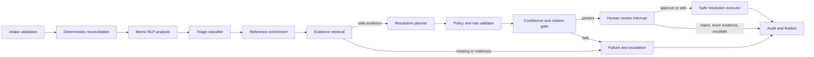

# Architecture Baseline

## System shape

TradeOps Copilot will use a modular monolith plus a background worker. The design has three deployable application units:

1. Web console: the existing React/TypeScript application.
2. API/orchestrator: a FastAPI service exposing versioned APIs, workflow coordination, audit reads, and real-time updates.
3. Worker: asynchronous ingestion, document processing, reference synchronization, and batch evaluation.

PostgreSQL is the durable system of record, Redis supports queues and transient coordination, and file/object storage is accessed through a typed port. The default demo remains runnable with deterministic local adapters.

## Ownership boundaries

- Domain code owns trade-event validation, exception facts, proposal state, and invariant checks.
- Application services coordinate use cases and typed ports.
- Adapters own databases, queues, model providers, public-data clients, and file storage.
- The web client presents server-owned decisions and never becomes the source of financial, authorization, or workflow rules.
- Lovable remains limited to frontend structure, presentation, accessibility, and design-system work.

## Dependency direction

Domain modules do not import FastAPI, SQLAlchemy, LangGraph, model SDKs, vector stores, or public-data clients. Application services depend on domain types and ports. Infrastructure adapters depend inward on those ports.

## Workflow safety model

Model output is advisory data. Structured schemas, deterministic validation, cited evidence, confidence/assumption fields, and explicit approval gates are required before any synthetic-state mutation. Side effects are allowlisted, idempotent, and recorded as audit events.

## Initial module boundaries

- `web`: routes, accessible components, API client, and real-time presentation
- `domain`: typed trade events, exceptions, proposals, approvals, and audit events
- `application`: ingestion, investigation, review, and resolution use cases
- `orchestration`: typed graph state, nodes, routing, checkpoints, and interrupts
- `adapters`: persistence, queue, retrieval, models, public data, and object storage
- `worker`: asynchronous command handlers
- `observability`: logging, metrics, traces, and correlation context

## Evolution criteria

Keep these modules in one backend codebase until independent scaling, deployment ownership, data ownership, or reliability requirements justify a service boundary. Network separation is not a substitute for clear module ownership.

## Investigation workflow

The graph captures stable workflow, prompt, provider, and model versions. In-memory checkpoints are only the unit-test/default composition; normal local composition uses the PostgreSQL checkpoint adapter. No model node performs monetary/date calculations or writes state directly.
