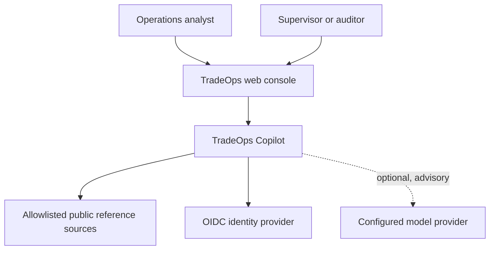
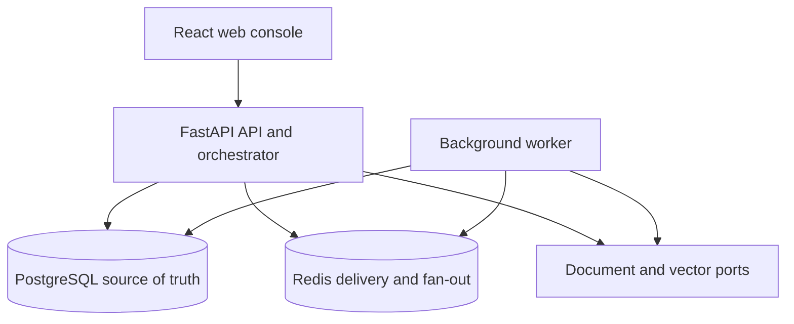
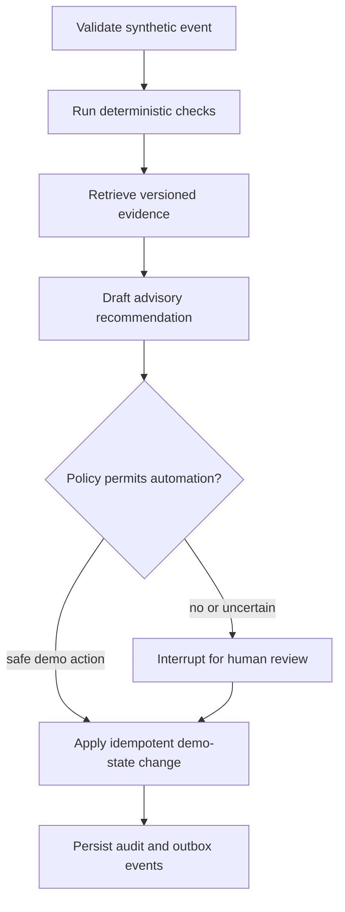

# System architecture

## System context

TradeOps Copilot is a synthetic educational system. It accepts no orders and connects to no brokerage, exchange, settlement network, custodian, or real trading account.

The browser is untrusted. The API authenticates every protected request, authorizes the requested operation, validates inputs, and owns all state transitions. Public-source and model-provider responses are also untrusted and pass through bounded adapters and validation.

## Deployable units and data stores

| Unit                     | Responsibilities                                                                                | Explicit exclusions                                                    |
| ------------------------ | ----------------------------------------------------------------------------------------------- | ---------------------------------------------------------------------- |
| Web console              | Accessible investigation, evidence, approval, audit, and administrative views                   | Authorization decisions, financial calculations, direct provider calls |
| API/orchestrator         | HTTP/WebSocket contracts, authentication, authorization, deterministic policy, workflow control | Long blocking jobs, arbitrary model tools                              |
| Worker                   | Idempotent asynchronous ingestion, enrichment, indexing, evaluation, and outbox delivery        | User-session authorization shortcuts, untracked side effects           |
| PostgreSQL               | Authoritative application state, audit entries, workflow metadata, approvals, outbox            | Secrets, raw authorization tokens                                      |
| Redis                    | Bounded work delivery, locks, rate controls, real-time fan-out, caches                          | Authoritative business state                                           |
| Document/vector adapters | Versioned evidence lookup with provenance and citations                                         | Final policy decisions or unrestricted filesystem access               |

This is a modular monolith plus worker, not a fleet of microservices. Python domain modules are shared by the API and worker, and they depend on ports rather than frameworks or providers.

## Governed exception workflow

Calculations, dates, validation, permissions, thresholds, and final action authorization are deterministic. Model output can classify, summarize, and draft only. Missing or weak evidence produces a refusal or escalation, not a fabricated answer.

## Trust boundaries and controls

| Boundary                     | Principal risks                                      | Required controls                                                                                                  |
| ---------------------------- | ---------------------------------------------------- | ------------------------------------------------------------------------------------------------------------------ |
| Browser to API               | forged roles, invalid state, replay, injection       | OIDC token validation, server-side RBAC, schemas, idempotency keys, optimistic concurrency, rate limits            |
| API to worker                | duplicate delivery, lost work, unauthorized task     | transactional outbox, signed/typed task envelope, retry policy, idempotent consumer                                |
| Application to model         | prompt injection, data disclosure, invalid structure | synthetic/redacted context, allowlisted tools, structured outputs, schema validation, timeouts, provider isolation |
| Application to public source | stale or hostile content, terms drift, availability  | allowlisted hosts, licensing register, provenance, size limits, validation, caching, circuit breaker               |
| Retrieval to workflow        | irrelevant or manipulated evidence                   | corpus versions, source metadata, citation verification, confidence/refusal thresholds                             |
| Telemetry pipeline           | secret or personal-data leakage                      | field allowlist, redaction, bounded payloads, no raw tokens or unrestricted prompts                                |

## Repository layout during the initial release

The Lovable-synced React application remains at the repository root until its move can be verified without breaking preview synchronization. New Python deployables live under `apps/api` and `apps/worker`; reusable, framework-independent Python modules live under `packages`. The intended `apps/web` move is tracked as a packaging cleanup and does not affect runtime boundaries.

## Availability and degradation

- If the configured model is unavailable, deterministic detection, investigation, human review, and audit remain available.
- If public sources are unavailable, the system uses provenance-stamped cached data where policy allows or marks enrichment unavailable.
- If Redis is unavailable, authoritative state remains in PostgreSQL; asynchronous work resumes from the outbox after recovery.
- Readiness fails when a required dependency cannot serve safe traffic; liveness remains process-local.

## Related decisions

- [ADR-0001: Modular monolith plus worker](decisions/0001-modular-monolith-plus-worker.md)
- [ADR-0002: LangGraph for governed orchestration](decisions/0002-langgraph-governed-orchestration.md)
