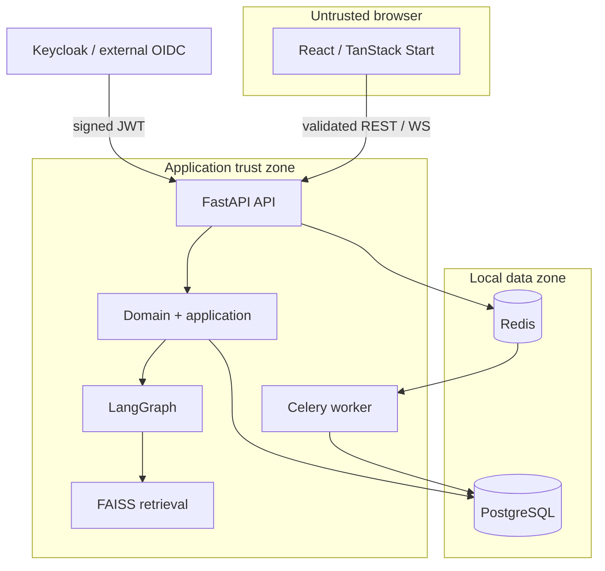
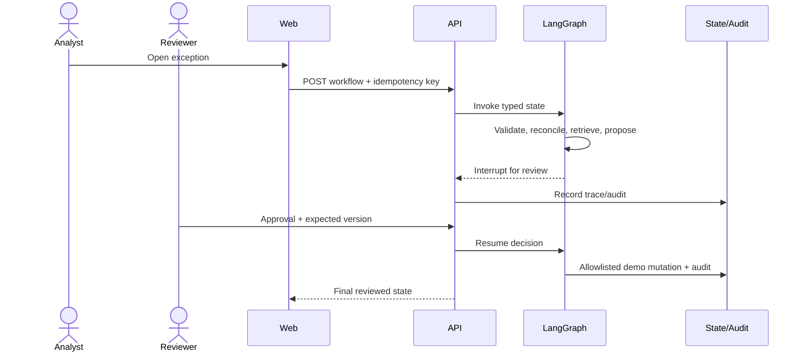
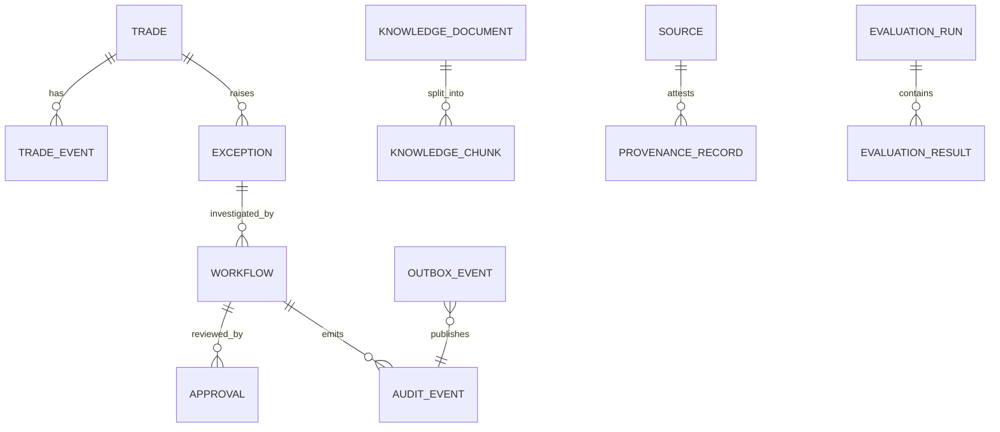

# Architecture overview

Owner: platform maintainer. Purpose: explain runtime boundaries and trust flow.

Components point inward: frameworks/adapters → application ports → domain. The browser owns presentation only. Authorization, validation, calculations, workflow policy, and mutation stay server-side. Public content is untrusted data; it cannot issue instructions or authorize tools. Model output is structured advisory data and cannot bypass deterministic gates or approval.

Failure handling: invalid input is rejected; duplicate commands replay safely; version conflicts return conflict; missing/malicious evidence escalates; provider errors fall back to mock or escalation; outbox gaps defer; WebSocket clients use polling fallback; observability failure never changes domain results.
