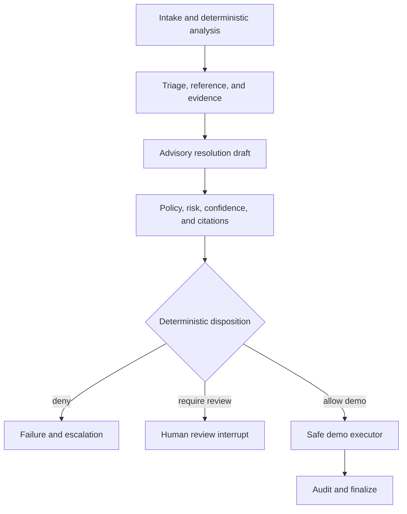

# Governed LangGraph workflow

- **Owner:** AI and domain maintainers
- **Purpose:** Make graph state, routing, authority, and the current implementation boundary reviewable.

## State

The initial typed state records workflow/graph/prompt versions, the bounded advisory request, deterministic disposition, schema-validated advisory output, citation-gate result, status, error code, and an append-only visited-node trace. Timestamps, database clients, tokens, and unrestricted documents are not hidden globals.

## Current implementation boundary

All thirteen required nodes are explicit. The deterministic mock provider drives tested review, escalation, and allowlisted low-risk paths. The current `human_review_interrupt` node ends in `awaiting_review`; it does not fabricate a reviewer decision. The next increment adds a durable checkpointer plus validated approve/edit/reject/request-evidence/escalate resume commands before connecting the executor to persistence.

## Replay and side effects

The compiled unit-test graph has no side effects or checkpointer. Production compilation will use PostgreSQL checkpointing. Any node that later writes state uses an idempotency key because a resumed or retried node can run again from its start. Provider retries are bounded and do not silently switch models.
